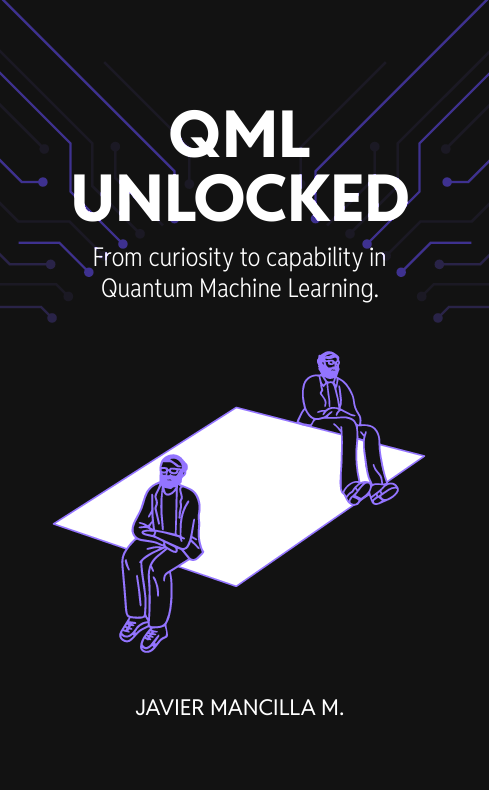

# QML Unlocked

**_From Curiosity to Capability in Quantum Machine Learning_**  
By Javier Mancilla Montero

## About the Book

**QML Unlocked** is a practical guide that bridges the gap between curiosity and capability in Quantum Machine Learning (QML). It explores fundamental quantum computing principles, real-world applications of quantum machine learning models, and hands-on Python implementations using quantum frameworks.

This repository contains accompanying **code examples**, **figures**, and **references** used in the book. If you're diving into QML, this repo will help you experiment with quantum algorithms and techniques.

## Table of Contents

The book covers a wide range of topics, including:

1. **Quantum Computing and Machine Learning**  
2. **Quantum Processing Units (QPUs) and Cloud Access**  
3. **Choosing the Right Quantum Hardware**  
4. **Implementing QML Models with Python** *(Code Available in Repo)*  
5. **The Importance of Preprocessing in QML** *(Code Available in Repo)*  
6. **Encoding Classical Data into Quantum States**  
7. **Quantum Support Vector Classifiers (QSVC)** *(Code Available in Repo)*  
8. **Variational Quantum Classifiers (VQC)** *(Code Available in Repo)*  
9. **Promising Quantum Approaches (QUBO-based SVM, Reservoir Computing, etc.)** *(Code Available in Repo)*  
10. **End-to-End Implementation of Quantum ML Solutions**  

For more details, **the full book is available on [Amazon](https://www.amazon.com)**.

---

## Code in This Repository

This repo contains the **Python code implementations** found in key chapters:

- **Chapter 4:** Implementing QML Models with Python  
- **Chapter 5:** The Importance of Preprocessing  
- **Chapter 7:** Quantum Support Vector Classifiers (QSVC)  
- **Chapter 8:** Variational Quantum Classifiers (VQC)  
- **Chapter 9:** Promising Quantum Approaches
- **Chapter 10:** End-to-end implementation

Additionally, a `References and Figures.md` file includes URLs and citations for all figures and external references used in the book.

---

## Citation & Attribution

If you use this repository or any of its code in your research or projects, please give proper attribution:

@book{Mancilla2025QMLUnlocked, author = {Javier Mancilla Montero}, title = {QML Unlocked: From Curiosity to Capability in Quantum Machine Learning}, year = {2025}, publisher = {Amazon} }

Feel free to share feedback, open issues, or contribute.

---

## Connect & Contribute

Found a bug? Have suggestions? Open an issue or submit a pull request.  
For inquiries or to stay updated with **Quantum Machine Learning** content follow me [LinkedIn](https://www.linkedin.com/in/mancillamontero/) 
